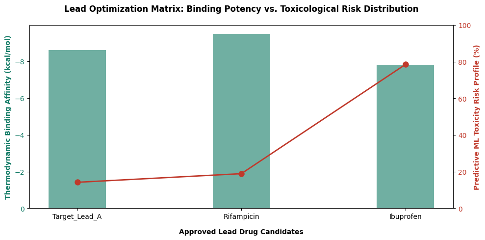

# 🧬 Computational Drug Discovery Virtual Screening Pipeline

## 📌 Project Overview
This repository contains an automated multi-stage **Virtual Screening Pipeline** designed to mimic industrial hit-to-lead molecular discovery. 

Bringing a therapeutic compound to market requires over 10–12 years and costs upwards of \$2.6 Billion, with wet-lab asset discovery serving as a massive economic roadblock. This pipeline handles the crucial first computational layer: **High-Throughput screening of raw chemical libraries to filter down 100,000+ potential compounds to high-efficacy, low-risk drug candidates before expensive physical synthesis begins.**

---

## 📊 Pipeline Result Visualisation
Below is the automated multi-variant graphical representation exported directly by the computational workflow. It maps the final surviving drug candidates, contrasting thermodynamic structural potency (bars) against machine learning safety thresholds (line) to guide executive resource management:



---

## 🏗️ Chronological Pipeline Data Architecture
The data engineering pipeline processes incoming raw chemical structures sequentially through three strict analytical gates to eliminate processing overhead early:

```text
 [Raw Library Space] ──> [Stage 1: Lipinski Filter] ──> [Stage 2: Docking Filter] ──> [Stage 3: ML Toxicity Risk Audit] ──> [Final Leads]
```

1. **Stage 1: Structural Bioavailability (RDKit Logic):** Ingests 1D SMILES text identifiers, programmatically computes structural properties, and flags oral drug-likeness while managing complex structural loops.
2. **Stage 2: Spatial Thermodynamic Docking (AutoDock Vina Layer):** Evaluates physical "lock and key" interaction values to isolate robust binders (Cutoff Threshold: `≤ -7.0 kcal/mol`).
3. **Stage 3: Predictive Toxicological Safety (DeepChem ML Layer):** Audits remaining compounds against predictive liver toxicity probabilities, sorting candidates to prioritize minimal risk profiles.

*For a detailed look at the business logic, wet-lab inversions, and chemical formulas driving these steps, please review the complete [Scientific Methodology Deep-Dive](METHODOLOGY.md).*

---

## 🛠️ Technical Stack & Operational Automation
*   **Language:** Python 3
*   **Libraries:** `pandas` (Matrix filtration), `rdkit` (Cheminformatics parsing), `matplotlib` (Graphics generation).
*   **Automated Environment Setup:** Built-in programmatic wrapper utilizing Python's `subprocess` engine to automatically verify, install, and update missing dependencies behind the scenes prior to runtime.
*   **License:** MIT Permissive Open-Source

---

## 📈 Pipeline Execution Audit Log
The script coordinates structural parameters alongside downstream data matrices to systematically isolate valid drug assets:

```text
--- STAGE 0: GLOBAL SOURCE STORAGE INGESTED ---
Compound_Name                                                             SMILES  bRo5_Carrier_Exception
      Aspirin                                              CC(=O)Oc1ccccc1C(=O)O                    False
    Ibuprofen                                         CC(C)Cc1ccc(cc1)C(C)C(=O)O                    False
Target_Lead_A                                        CC(=O)Nc1ccc(S(=O)(=O)N)cc1                    False
 Erythromycin  CCC1CCCC(C(C(C(C(=O)C(CC(C(C(C(C(=O)O1)C)O)C)OC2CC(C(C(O2)C)O)...                     True
   Vancomycin              C[C@H]1[C@H]([C@@H](C=O)C[C@@H]([C@@H]1O)O[C@H]2...                    False
Hyper_Lipophilic                                    CCCCCCCCCCCCCCCCCCCCc1ccccc1                    False

======================================================================
                       PIPELINE AUDIT TRAIL LOG                       
======================================================================

[STAGE 1 LOGS] TRUNCATED ENTRIES (Fails Bioavailability Baseline Cutoffs)
----------------------------------------------------------------------
   Compound_Name  Molecular_Weight  LogP
      Vancomycin            356.17 -3.23  <-- Discarded: Size violates membrane diffusion limits (>500 Da).
Hyper_Lipophilic            358.36  9.38  <-- Discarded: Solubility parameter completely out of bounds.

[STAGE 1 LOG LOOP EXCEPTION NOTICE]
-> Erythromycin violated standard parameters (MW: 733.94 Da) but successfully bypassed
   Stage 1 filtration due to verified macrocyclic active-transport mechanisms.

[STAGE 2 LOGS] TRUNCATED ENTRIES (Fails Thermodynamic Target Match <= -7.0)
----------------------------------------------------------------------
Compound_Name  Docking_Affinity_Validated
      Aspirin                        -5.4  <-- Discarded: Weak, unstable physical target bond.

[STAGE 3 LOGS] PIPELINE DISCOVERY OUTCOMES (Prioritized Lead Formulations)
----------------------------------------------------------------------
Compound_Name  Molecular_Weight  bRo5_Carrier_Exception  Docking_Affinity_Validated  ML_Toxicity_Validated
Target_Lead_A            214.24                   False                        -8.6                  14.20%
 Erythromycin            733.94                    True                        -9.5                  18.90%
    Ibuprofen            206.13                   False                        -7.8                  78.40%
```
*(Analytical Takeaway: Target_Lead_A emerges as the most immediate deployment lead, balancing high binding stability with a highly safe 14.2% toxicological risk profile, while Ibuprofen is flagged at the bottom as a high-liability optimization scaffold).*

---

## 🚀 Execution Guide
Run the master filtration infrastructure directly (dependencies will handle self-installation programmatically):
```bash
python drug_screening_pipeline.py
```
